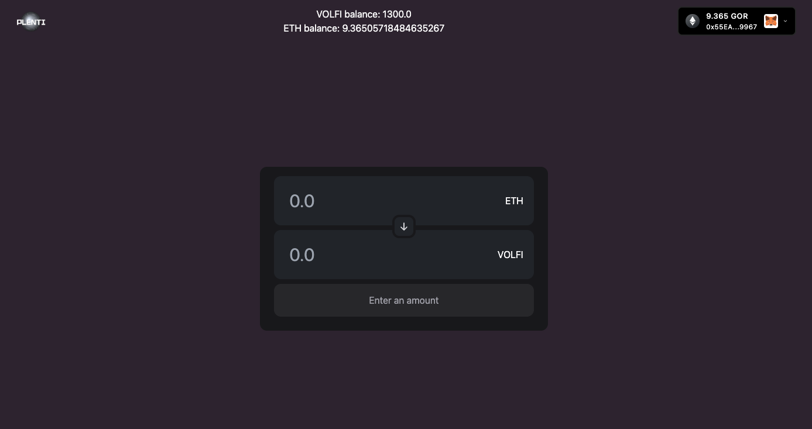
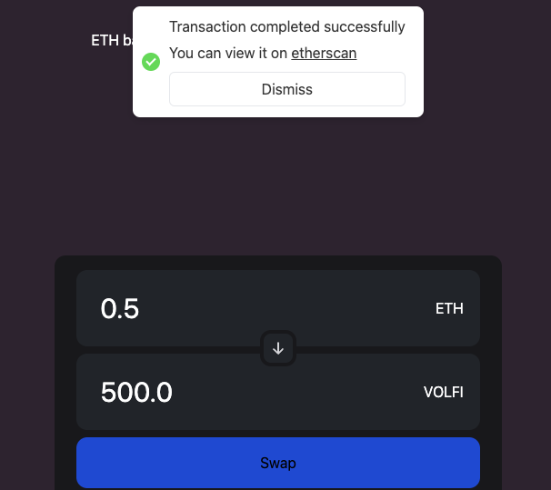
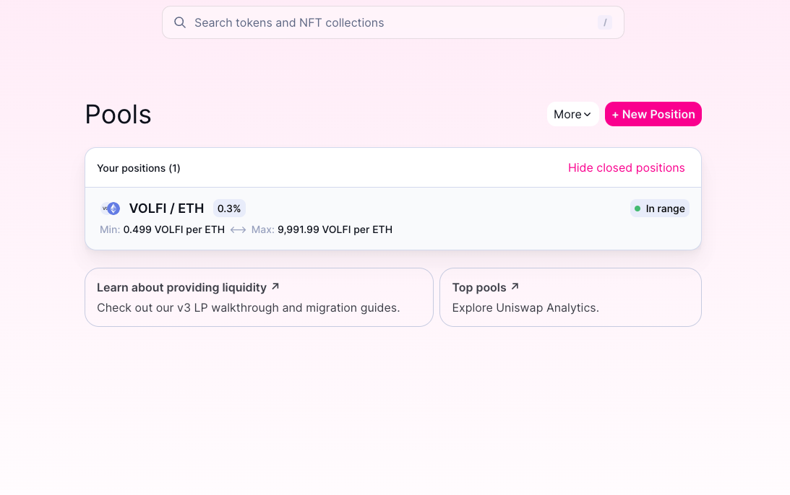

# VolSwap

## Introduction

This is an example of an ERC20 exchange platform. Users can exchange their ETH tokens for a custom ERC20 token (VOLFI) and vice-versa.

We deploy the Smart contract using [thirdweb deploy](https://portal.thirdweb.com/thirdweb-deploy) and interact with it using the thirdweb [TypeScript](https://portal.thirdweb.com/typescript) and [React](https://portal.thirdweb.com/react) SDKs.

**Check out the Demo here**: https://volswap-nstanogias.vercel.app/



Upon a sucessful swap, user sees a confirmation modal with a link on etherscan to check the transaction



## Tools

- [**thirdweb Deploy**](https://portal.thirdweb.com/thirdweb-deploy): Deploy our `Volswap.sol` smart contract with zero configuration by running `npx thirdweb deploy`.
- [**thirdweb React SDK**](https://docs.thirdweb.com/react): to enable users to connect and disconnect their wallets with our website, and interact with our smart contracts using hooks like [useBalance](https://portal.thirdweb.com/react/react.usebalance) [useContract](https://portal.thirdweb.com/react/react.usecontract) and others.
- [**thirdweb Connect Wallet Button**](https://portal.thirdweb.com/react/react.connectwallet): Button to connect a user’s wallet to your app

## How to run the project

- Run the project locally:

```bash
npm run dev
```

## Volswap Smart Contract

For the purpose of this application we created a custom ERC20 token (VOLFI), which we pass as an argument to the constructor of the Volswap smart contract

The Volswap.sol smart contract can be broken down into two parts:

1. swapEthToToken
2. swapTokenToEth

### swapEthToToken

This is the logic where ETH are exchanged to VOLFI tokens and then VOLFI is transferred to user wallet

```solidity
        function swapEthToToken() public payable returns (uint256 tokenAmount) {
            require(msg.value > 0, "You need to send some ETH to proceed");

            uint256 amountToBuy = msg.value * voltokensPerEth;
            uint256 vendorTokenBalance = volToken.balanceOf(address(this));
            require(vendorTokenBalance >= amountToBuy, "Volswap contract doesn't have enough token balance");
            (bool sent) = volToken.transfer(msg.sender, amountToBuy);

            require(sent, "Failed to transfer tokens to user");

            return amountToBuy;
        }
```

### swapTokenToEth

This is the logic where VOLFI tokens are exchanged to ETH and then ETH is transferred to user wallet

```solidity
        function swapTokenToEth(uint256 tokenAmountToSell) public {
            require(tokenAmountToSell > 0, "Specify an amount greater than 0");
            uint256 userBalance = volToken.balanceOf(msg.sender);
            require(userBalance >= tokenAmountToSell, "You have insufficient funds");
            uint256 amountOfEthToTransfer = tokenAmountToSell / voltokensPerEth;
            uint256 ownerEthBalance = address(this).balance;
            require(ownerEthBalance >= amountOfEthToTransfer, "Volswap contract doesn't have enough eth balance");
            (bool sent) = volToken.transferFrom(msg.sender, address(this), tokenAmountToSell);
            require(sent, "Failed to transfer tokens");
            (sent,) = msg.sender.call{value: amountOfEthToTransfer}("");
            require(sent, "Failed to transfer ETH");
        }
```

## Liquidity Pool

In order to add value to VOLFI token, a liquidity pool is created on Uniswap.


